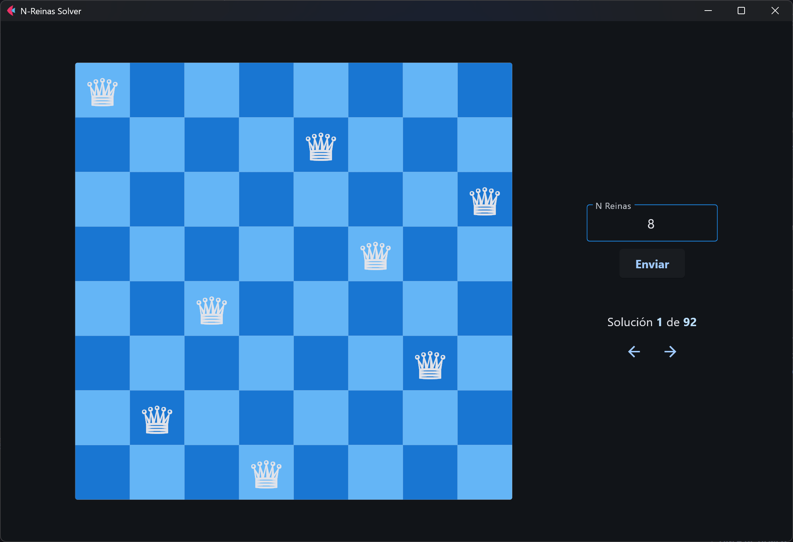

# ♛ N-Reinas Solver

## 🧑‍💻 Autores
- Argüello Nájera Juan Diego
- Diaz Aguilar Hans Uriel
- Palma Tellez Herzon


## 🚀 Requisitos

- Python ≥ 3.10
- [uv](https://docs.astral.sh/uv/getting-started/installation/) (gestor de paquetes)
- [Cabal](https://www.haskell.org/cabal/) (para compilar el servidor Haskell)


## ▶️ Cómo ejecutar el proyecto

### 1. 🔧 Iniciar el servidor de Haskell

Desde la carpeta `/server`, compila el servidor y entra al intérprete:

```bash
cd server
cabal build
cabal repl
```

Dentro de ghci, ejecuta el servidor llamando al método main:
```haskell
main
```

### 2. 💻 Ejecutar la interfaz gráfica (GUI)
En otra terminal, desde la raíz del proyecto:
```bash
uv run flet run
```

Esto instalará las dependencias y abrirá la aplicación gráfica en una ventana donde se pueden observar las soluciones del problema.

> [!note]
> Es importante que primero se ejecute el servidor de Haskell y posteriormente la aplicación de Flet.



